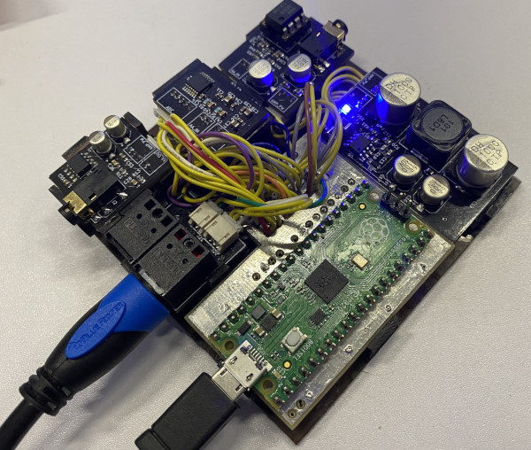

:point_right: [Japanese](./README_jp.md)

# USB Sound Card with Raspberry Pi Pico

## Introduction

This is a project of USB sound card constructed with Raspberry Pi Pico microcontroller board.  
Hardware schematics and firmware sourcecode are including.

## Features

- USB Audio Class 2.0 (Connected by USB 2.0 Full speed)
- 2ch Line in
- 2ch Line out
- 2ch SPDIF in
- 2ch SPDIF out
- 2ch Headphone out
- Maximum resolution is 24bit
- Maximum frequency is 96KHz

In/out USB datastreams can not activate same time at 24bit/96KHz because lacking of transfaring bandwidth.  
"Line in" and "SPDIF in" are mixed to one buffer to saving bandwidth of USB. Each volumes can control via generic USB driver. (Currently, It supports only for Windows WinUSB.)

## Hardware

I used KiCad6 to design the schematics.  
If you view the schematics, Please download [KiCad 6 or later](https://www.kicad.org/).

The hardware design is so simply and no ingenuity because I am not an expert of electronics.  
But I designed the schematics with the concept of separating modules by function to facilitate testing and adding other functions.  
Electronic components which are used are general and easily obtainable.   
The DAC uses PCM5102a, May be easily replaced with any of PCM510x series. You can choise depending on availability those. (But I have never tried to this.)

## Firmware 

The firmware is wrote by C and C++. 
SPDIF control not use dedicated hardwares and are doing by the software with one of Pico's features called PIO. It provides to running IO independently of the main processer.   
As above, Schematics are separated by function. This is also true for software. The hardware's functions are associated as a class for each in the software.

The first of building the firmware, you should install Pico's SDK and CMake.
Please refer to follows for details.
- [Raspberry Pi Documentation The C/C++ SDK](https://www.raspberrypi.com/documentation/microcontrollers/c_sdk.html)  
- [CMake](https://cmake.org/)

Let's prepare a directory for Cmake setup.
> mkdir build  
> cd build  

For standard setup
> cmake ..  

With tracing log
> cmake .. -DLOG=1   

'LOG' is passed to tinyusb's debug level. That description is [here](https://docs.tinyusb.org/en/latest/reference/getting_started.html#log).

With profiling
> cmake .. -DPROFILE=1

To usb device control use TinyUSB. It is included in PicoSDK.
TinyUSB for Pico has a problem what memory deallocation of endpoint. Therefore, I prepared [a patch](patch/tinyusb-rp2040-allow-memory-preallocation.patch) for avoiding it. If you encounter to crashing the device in TinyUSB memory allocation,
It may resolve by applying [the patch](patch/tinyusb-rp2040-allow-memory-preallocation.patch) to TinyUSB.

## Debugging

The device outputs tracing log to serial port (CDC) owned myself. You can see the contents via serial monitor.   
And following commands are usable via serial monitor input.

> stats_on

Turn on output of internal stats every 0.5s when LOG is greater than 0.
 
> stats_off

Turn on output of internal stats.

> perf

Output mesured performance statistics when profiling enabled.

## Device unique request (Windows Only)
Unique requests which to control internal behaviors from host device have been implemented in the firmware.
If host os is Windows, The device requests to installation WinUSB driver to the OS by description of Microsoft OS Descriptor. Thereby user mode applications on the host become possible to transfer requests to the device.

[control_uwp](control_uwp) is an application to controls the device volumes by using WinUSB via Windows Runtime.
To building requires [Visual Studio 2022 with C# UWP application development](https://visualstudio.microsoft.com/).

## References
- [Raspberry Pi Pico Datasheet](https://datasheets.raspberrypi.com/pico/pico-datasheet.pdf?_gl=1*lbhpfj*_ga*MjA5MDIxNzYzOC4xNjg0MzYzNDM5*_ga_22FD70LWDS*MTY5NjU4ODY5OS4zNS4xLjE2OTY1ODg5NTIuMC4wLjA.)  
- [RP2040 Datasheet](https://datasheets.raspberrypi.com/rp2040/rp2040-datasheet.pdf?_gl=1*1rlrh3d*_ga*MjA5MDIxNzYzOC4xNjg0MzYzNDM5*_ga_22FD70LWDS*MTY5NjU4ODY5OS4zNS4xLjE2OTY1ODg4OTYuMC4wLjA.)    
- [SPECIFICATION OF THE DIGITAL AUDIO INTERFACE (The AES/EBU interface)](https://tech.ebu.ch/docs/tech/tech3250.pdf)
- [Texas Instruments PCM510xA 2.1 VRMS, 112/106/100 dB Audio Stereo DAC with PLL and 32-bit, 384 kHz PCM Interface](https://www.ti.com/lit/ds/symlink/pcm5102a.pdf?ts=1696564046679&ref_url=https%253A%252F%252Fwww.ti.com%252Fproduct%252FPCM5102A)
- [Texas Instruments PCM1808 Single-Ended, Analog-Input 24-Bit, 96-kHz Stereo ADC](https://www.ti.com/jp/lit/ds/symlink/pcm1808.pdf?ts=1696503248668&ref_url=https%253A%252F%252Fwww.ti.com%252Fproduct%252Fja-jp%252FPCM1808)

## Disclaimer

I not responsible and guarantee even if you get something damage or injury when doing base on this project.  
Please you keep mind DIY.